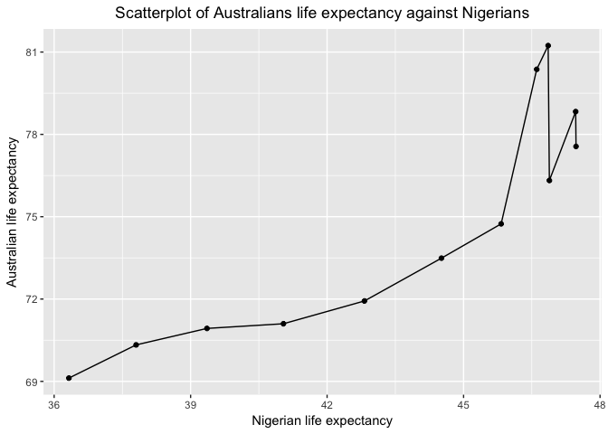
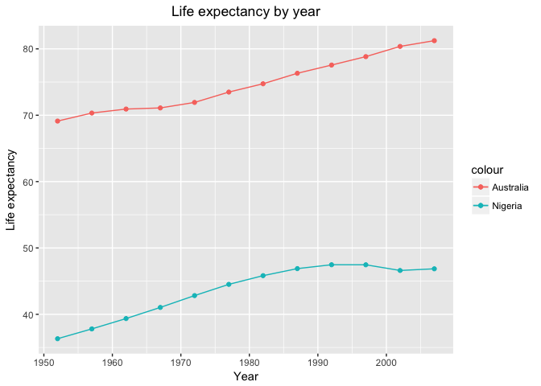
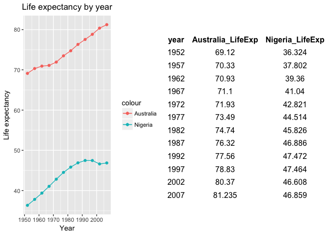
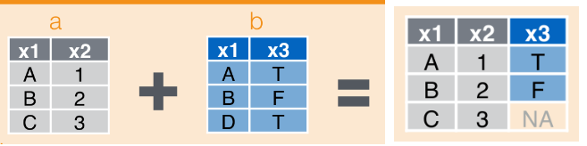
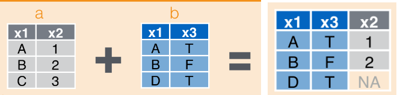
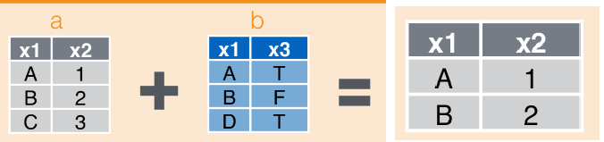
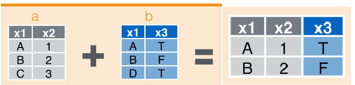
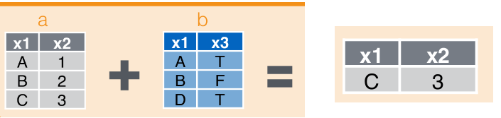
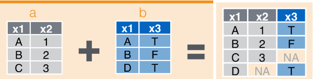
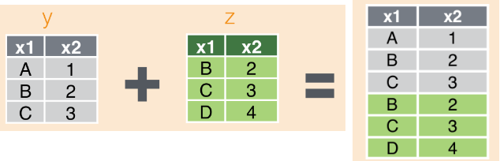

Homework4: Tidy data and joins
================
Jummy David
October 9, 2018

-   [TASK1: Data Reshaping Prompts (Activity2): `gather` and `spread`](#task1-data-reshaping-prompts-activity2-gather-and-spread)
    -   [Make a `tibble` with one row per year and columns for life expectancy for two or more countries.](#make-a-tibble-with-one-row-per-year-and-columns-for-life-expectancy-for-two-or-more-countries.)
    -   [Make scatterplot of life expectancy for one country against that of another.](#make-scatterplot-of-life-expectancy-for-one-country-against-that-of-another.)
-   [TASK2: Join Prompts (Activity1):](#task2-join-prompts-activity1)
    -   [Create a second data frame, complementary to Gapminder.](#create-a-second-data-frame-complementary-to-gapminder.)
    -   [Join this with (part of) Gapminder using a `dplyr` join function and make some observations about the process and result.](#join-this-with-part-of-gapminder-using-a-dplyr-join-function-and-make-some-observations-about-the-process-and-result.)
    -   [Explore the different types of joins.](#explore-the-different-types-of-joins.)
-   [References:](#references)

In this homework, we will reshape the gapminder dataset and also join two datasets. Data reshaping is mainly used to make data analysis easier and when a dataset is not in a suitable form. Many times we may need to reshape our data to make it more suitable for our research questions. In data reshaping, we use the commands `gather()` and `spread()` from `tidyr`.

Joins may similarly be used when we have more than one dataset. The functions that will be used here includes `left_join()`, `right_join()`, `left_join()`, `semi_join()`, `anti_join()`, `inner_join()`, and `full_join()`.

To start with, load the `tidyverse`, `gridExtra` and `gapminder` R packages in a suppressed format.

``` r
suppressPackageStartupMessages(library(tidyverse))
```

    ## Warning: package 'ggplot2' was built under R version 3.3.2

    ## Warning: package 'readr' was built under R version 3.3.2

    ## Warning: package 'purrr' was built under R version 3.3.2

    ## Warning: package 'dplyr' was built under R version 3.3.2

``` r
suppressPackageStartupMessages(library(gapminder))
```

    ## Warning: package 'gapminder' was built under R version 3.3.2

``` r
suppressPackageStartupMessages(library(gridExtra))
```

    ## Warning: package 'gridExtra' was built under R version 3.3.2

TASK1: Data Reshaping Prompts (Activity2): `gather` and `spread`
----------------------------------------------------------------

``` r
head(gapminder)
```

    ## # A tibble: 6 x 6
    ##   country     continent  year lifeExp      pop gdpPercap
    ##   <fct>       <fct>     <int>   <dbl>    <int>     <dbl>
    ## 1 Afghanistan Asia       1952    28.8  8425333      779.
    ## 2 Afghanistan Asia       1957    30.3  9240934      821.
    ## 3 Afghanistan Asia       1962    32.0 10267083      853.
    ## 4 Afghanistan Asia       1967    34.0 11537966      836.
    ## 5 Afghanistan Asia       1972    36.1 13079460      740.
    ## 6 Afghanistan Asia       1977    38.4 14880372      786.

### Make a `tibble` with one row per year and columns for life expectancy for two or more countries.

#### First approach: Using the command `group_by`.

Here I used the command `group_by` to group the life expectancy of each country (Nigeria and Australia) by year. The table here shows that Australia has the highest life expectancy across all years when compared to Nigeria's.

``` r
TidyData1 <- gapminder %>%
  select(year,lifeExp,country) %>%
  filter(country == 'Nigeria' | country == 'Australia') %>%
  group_by(year) %>%
  spread(key = country, value = lifeExp) %>% #the key is what we want to spread (i.e make new variables from country and by life expectancy). 
  rename(Australia_LifeExp = Australia, Nigeria_LifeExp=Nigeria) #I rename the countries' name here to indicate that these are life expectancy of each country.
```

    ## Warning: package 'bindrcpp' was built under R version 3.3.2

``` r
knitr::kable(TidyData1)
```

|  year|  Australia\_LifeExp|  Nigeria\_LifeExp|
|-----:|-------------------:|-----------------:|
|  1952|              69.120|            36.324|
|  1957|              70.330|            37.802|
|  1962|              70.930|            39.360|
|  1967|              71.100|            41.040|
|  1972|              71.930|            42.821|
|  1977|              73.490|            44.514|
|  1982|              74.740|            45.826|
|  1987|              76.320|            46.886|
|  1992|              77.560|            47.472|
|  1997|              78.830|            47.464|
|  2002|              80.370|            46.608|
|  2007|              81.235|            46.859|

#### Second approach: Using the command `tibble`.

Here I used the command `tibble` to create a data frame similar to the previous one. This gives a similar data frame.

``` r
LifeExpectancy_ByCountry <- gapminder %>%
  select(year,lifeExp,country) %>% #selects 3 variable from the gapminder data
  filter(country == 'Nigeria' | country == 'Australia') #filter down to just two years (Nigeria and Australia)
  

tidyData <-  tibble(year=LifeExpectancy_ByCountry$year,lifeExp=LifeExpectancy_ByCountry$lifeExp,country=LifeExpectancy_ByCountry$country)  #create a dataframe of 3 variables (year, life expectancy and country)

  TidyData2 <- spread(tidyData, key = "country", value = "lifeExp") %>% #spread the country by their life expectancy for each year
    rename(Australia_LifeExp = Australia, Nigeria_LifeExp=Nigeria) #rename them for others to be able to understand what they are. 

    

knitr::kable(TidyData2)
```

|  year|  Australia\_LifeExp|  Nigeria\_LifeExp|
|-----:|-------------------:|-----------------:|
|  1952|              69.120|            36.324|
|  1957|              70.330|            37.802|
|  1962|              70.930|            39.360|
|  1967|              71.100|            41.040|
|  1972|              71.930|            42.821|
|  1977|              73.490|            44.514|
|  1982|              74.740|            45.826|
|  1987|              76.320|            46.886|
|  1992|              77.560|            47.472|
|  1997|              78.830|            47.464|
|  2002|              80.370|            46.608|
|  2007|              81.235|            46.859|

#### Using the command `gather`

In a simple language, the command `gather` may be used to undo what `spread` did.

``` r
gather(TidyData2, key = "Country", value = "Life_Expectancy", Australia_LifeExp, Nigeria_LifeExp) %>% # the key is the variable that we want to create, value is what will be assigned to the variable we are creating and Australia_LifeExp and Nigeria_LifeExp are the variables we are merging. Here the command gather does the job at once.
  knitr::kable() #make the table looks better when rendering.
```

|  year| Country            |  Life\_Expectancy|
|-----:|:-------------------|-----------------:|
|  1952| Australia\_LifeExp |            69.120|
|  1957| Australia\_LifeExp |            70.330|
|  1962| Australia\_LifeExp |            70.930|
|  1967| Australia\_LifeExp |            71.100|
|  1972| Australia\_LifeExp |            71.930|
|  1977| Australia\_LifeExp |            73.490|
|  1982| Australia\_LifeExp |            74.740|
|  1987| Australia\_LifeExp |            76.320|
|  1992| Australia\_LifeExp |            77.560|
|  1997| Australia\_LifeExp |            78.830|
|  2002| Australia\_LifeExp |            80.370|
|  2007| Australia\_LifeExp |            81.235|
|  1952| Nigeria\_LifeExp   |            36.324|
|  1957| Nigeria\_LifeExp   |            37.802|
|  1962| Nigeria\_LifeExp   |            39.360|
|  1967| Nigeria\_LifeExp   |            41.040|
|  1972| Nigeria\_LifeExp   |            42.821|
|  1977| Nigeria\_LifeExp   |            44.514|
|  1982| Nigeria\_LifeExp   |            45.826|
|  1987| Nigeria\_LifeExp   |            46.886|
|  1992| Nigeria\_LifeExp   |            47.472|
|  1997| Nigeria\_LifeExp   |            47.464|
|  2002| Nigeria\_LifeExp   |            46.608|
|  2007| Nigeria\_LifeExp   |            46.859|

``` r
#Here I did it step by step to reshape back to the originale shape.
UntidyData <- TidyData2 %>%
    rename(Australia = Australia_LifeExp, Nigeria=Nigeria_LifeExp) #the chunk code here first rename the variables. 
    
UntidyData %>%
   gather('Australia', 'Nigeria', key = "Country", value = "Life_Expectancy") %>%
  knitr::kable() #then the chunk code here gather as before but with the countries' name renamed to the original name.
```

|  year| Country   |  Life\_Expectancy|
|-----:|:----------|-----------------:|
|  1952| Australia |            69.120|
|  1957| Australia |            70.330|
|  1962| Australia |            70.930|
|  1967| Australia |            71.100|
|  1972| Australia |            71.930|
|  1977| Australia |            73.490|
|  1982| Australia |            74.740|
|  1987| Australia |            76.320|
|  1992| Australia |            77.560|
|  1997| Australia |            78.830|
|  2002| Australia |            80.370|
|  2007| Australia |            81.235|
|  1952| Nigeria   |            36.324|
|  1957| Nigeria   |            37.802|
|  1962| Nigeria   |            39.360|
|  1967| Nigeria   |            41.040|
|  1972| Nigeria   |            42.821|
|  1977| Nigeria   |            44.514|
|  1982| Nigeria   |            45.826|
|  1987| Nigeria   |            46.886|
|  1992| Nigeria   |            47.472|
|  1997| Nigeria   |            47.464|
|  2002| Nigeria   |            46.608|
|  2007| Nigeria   |            46.859|

### Make scatterplot of life expectancy for one country against that of another.

Here I make the scatter plot of life expectancy of one country against the other. This also shows a similar information as what we have in the table. It actually makes no much sense comparing the life expectancy of one country against the other.

``` r
TidyData1 %>%
  ggplot(aes(Nigeria_LifeExp,Australia_LifeExp)) +
  geom_point() + #gives points of the data
  geom_line() + #makes a line to join the points
  labs(x="Nigerian life expectancy", y = "Australian life expectancy") + #the chunk code here labels the plot
  ggtitle("Scatterplot of Australians life expectancy against Nigerians")+theme(plot.title = element_text(hjust = 0.5)) #the code gives the title to the plot
```


``` r
TidyData2 %>% #the code here shows that TidyData1 using group_by and TidyData2 using tibble give the same result. 
  ggplot(aes(Nigeria_LifeExp,Australia_LifeExp)) +
  geom_point() +
  geom_line() +
  labs(x="Nigerian life expectancy", y = "Australian life expectancy") +
  ggtitle("Scatterplot of Australians life expectancy against Nigerians")+theme(plot.title = element_text(hjust = 0.5))
```



I thought comparing both countries' life expectancy over the years may make more sense and so I tried this here. We see that throughout the years, the life expectancy of Australia has a huge difference relative to Nigeria. For all years, Nigeria generally experienced a low life expectancy, though increases in some years, but still very low when compared to Australia.

``` r
TidyData_Plot <- TidyData2 %>%
  ggplot() +
  geom_point(aes(year,Australia_LifeExp, colour = "Australia")) +
  geom_line(aes(year,Australia_LifeExp, colour = "Australia")) +
  geom_point(aes(year,Nigeria_LifeExp, colour = "Nigeria")) +
  geom_line(aes(year,Nigeria_LifeExp, colour = "Nigeria")) +
  labs(x="Year", y = "Life expectancy") +
  ggtitle("Life expectancy by year")+theme(plot.title = element_text(hjust = 0.5))
TidyData_Plot
```



Here I am combining table and figure. I first use the command `tableGrob` to transform the table into a Grob. Then use the command `grid.arrange` from the package `gridExtra` to place the table and the figure side-by-side.

``` r
Table_Grob <- tableGrob(TidyData2, theme=ttheme_minimal(), rows=NULL)
grid.arrange(TidyData_Plot,Table_Grob,nrow=1)
```



TASK2: Join Prompts (Activity1):
--------------------------------

### Create a second data frame, complementary to Gapminder.

Here I decided to use the dataset `country_codes` as my second data frame.

``` r
head(country_codes) #view the first 6 rows of the dataset
```

    ## # A tibble: 6 x 3
    ##   country     iso_alpha iso_num
    ##   <chr>       <chr>       <int>
    ## 1 Afghanistan AFG             4
    ## 2 Albania     ALB             8
    ## 3 Algeria     DZA            12
    ## 4 Angola      AGO            24
    ## 5 Argentina   ARG            32
    ## 6 Armenia     ARM            51

``` r
dim(country_codes) #the number of rows and column of the dataset
```

    ## [1] 187   3

``` r
str(country_codes) #the structure of the dataset
```

    ## Classes 'tbl_df', 'tbl' and 'data.frame':    187 obs. of  3 variables:
    ##  $ country  : chr  "Afghanistan" "Albania" "Algeria" "Angola" ...
    ##  $ iso_alpha: chr  "AFG" "ALB" "DZA" "AGO" ...
    ##  $ iso_num  : int  4 8 12 24 32 51 533 36 40 31 ...

Here I decided to rename the other two variables of the country\_codes data frame and then reduce it to the first 11 rows.

``` r
Rename_country_code <- rename(country_codes, country_initial=iso_alpha, country_num=iso_num) %>%
  head(11)

Rename_country_code %>% knitr::kable()
```

| country     | country\_initial |  country\_num|
|:------------|:-----------------|-------------:|
| Afghanistan | AFG              |             4|
| Albania     | ALB              |             8|
| Algeria     | DZA              |            12|
| Angola      | AGO              |            24|
| Argentina   | ARG              |            32|
| Armenia     | ARM              |            51|
| Aruba       | ABW              |           533|
| Australia   | AUS              |            36|
| Austria     | AUT              |            40|
| Azerbaijan  | AZE              |            31|
| Bahamas     | BHS              |            44|

### Join this with (part of) Gapminder using a `dplyr` join function and make some observations about the process and result.

Let us first `filter` the gapminder dataset by `year=2007` and then reduce to the first eleven rows to have a smaller dataframe.

``` r
Gapminder_Reduce <- gapminder %>%
  filter(year == "2007") %>% head(11) 

Gapminder_Reduce %>% knitr::kable()
```

| country     | continent |  year|  lifeExp|        pop|   gdpPercap|
|:------------|:----------|-----:|--------:|----------:|-----------:|
| Afghanistan | Asia      |  2007|   43.828|   31889923|    974.5803|
| Albania     | Europe    |  2007|   76.423|    3600523|   5937.0295|
| Algeria     | Africa    |  2007|   72.301|   33333216|   6223.3675|
| Angola      | Africa    |  2007|   42.731|   12420476|   4797.2313|
| Argentina   | Americas  |  2007|   75.320|   40301927|  12779.3796|
| Australia   | Oceania   |  2007|   81.235|   20434176|  34435.3674|
| Austria     | Europe    |  2007|   79.829|    8199783|  36126.4927|
| Bahrain     | Asia      |  2007|   75.635|     708573|  29796.0483|
| Bangladesh  | Asia      |  2007|   64.062|  150448339|   1391.2538|
| Belgium     | Europe    |  2007|   79.441|   10392226|  33692.6051|
| Benin       | Africa    |  2007|   56.728|    8078314|   1441.2849|

### Explore the different types of joins.

Examples of a second data frame you could build: One row per country, a country variable and one or more variables with extra info, such as language spoken, NATO membership, national animal, or capitol city. One row per continent, a continent variable and one or more variables with extra info, such as northern versus southern hemisphere.

In this task, I have decided to include tables to show what I am doing and reference accordingly.

#### The `left_join` command:



##### The `left_join (x,y)` command:

The command here returns all rows from `Gapminder_Reduce`, and all columns from `Gapminder_Reduce` and `Rename_country_code`. If there are multiple matches between the two dataset, all combination of the matches are returned. This is a `mutating join`. We basically get `Gapminder_Reduce` back, but with the addition of variables `country_initial` and `country_num` which are unique to Rename\_country\_code.

``` r
LeftData <- left_join(Gapminder_Reduce,Rename_country_code,by = "country") 
```

    ## Warning: Column `country` joining factor and character vector, coercing
    ## into character vector

``` r
LeftData %>% knitr::kable()
```

| country     | continent |  year|  lifeExp|        pop|   gdpPercap| country\_initial |  country\_num|
|:------------|:----------|-----:|--------:|----------:|-----------:|:-----------------|-------------:|
| Afghanistan | Asia      |  2007|   43.828|   31889923|    974.5803| AFG              |             4|
| Albania     | Europe    |  2007|   76.423|    3600523|   5937.0295| ALB              |             8|
| Algeria     | Africa    |  2007|   72.301|   33333216|   6223.3675| DZA              |            12|
| Angola      | Africa    |  2007|   42.731|   12420476|   4797.2313| AGO              |            24|
| Argentina   | Americas  |  2007|   75.320|   40301927|  12779.3796| ARG              |            32|
| Australia   | Oceania   |  2007|   81.235|   20434176|  34435.3674| AUS              |            36|
| Austria     | Europe    |  2007|   79.829|    8199783|  36126.4927| AUT              |            40|
| Bahrain     | Asia      |  2007|   75.635|     708573|  29796.0483| NA               |            NA|
| Bangladesh  | Asia      |  2007|   64.062|  150448339|   1391.2538| NA               |            NA|
| Belgium     | Europe    |  2007|   79.441|   10392226|  33692.6051| NA               |            NA|
| Benin       | Africa    |  2007|   56.728|    8078314|   1441.2849| NA               |            NA|

##### The `left_join (y,x)` command:

The command here returns all rows from `Rename_country_code`, and all columns from `Gapminder_Reduce` and `Rename_country_code`. If there are multiple matches between the two dataset, all combination of the matches are returned. This is a `mutating join`. We basically get a similar result as with `left_join (y,x)` but countries `Armenia`, `Aruba` and `Azerbaijan` survive in the join, even though no data from these countries apper in `Gapminder_Reduce`. As a result, these countries have NAs for continent, year, lifeExp, pop and gdpPercap.

``` r
LeftData2 <- left_join(Rename_country_code,Gapminder_Reduce) 
```

    ## Joining, by = "country"

    ## Warning: Column `country` joining character vector and factor, coercing
    ## into character vector

``` r
LeftData2 %>% knitr::kable()
```

| country     | country\_initial |  country\_num| continent |  year|  lifeExp|       pop|   gdpPercap|
|:------------|:-----------------|-------------:|:----------|-----:|--------:|---------:|-----------:|
| Afghanistan | AFG              |             4| Asia      |  2007|   43.828|  31889923|    974.5803|
| Albania     | ALB              |             8| Europe    |  2007|   76.423|   3600523|   5937.0295|
| Algeria     | DZA              |            12| Africa    |  2007|   72.301|  33333216|   6223.3675|
| Angola      | AGO              |            24| Africa    |  2007|   42.731|  12420476|   4797.2313|
| Argentina   | ARG              |            32| Americas  |  2007|   75.320|  40301927|  12779.3796|
| Armenia     | ARM              |            51| NA        |    NA|       NA|        NA|          NA|
| Aruba       | ABW              |           533| NA        |    NA|       NA|        NA|          NA|
| Australia   | AUS              |            36| Oceania   |  2007|   81.235|  20434176|  34435.3674|
| Austria     | AUT              |            40| Europe    |  2007|   79.829|   8199783|  36126.4927|
| Azerbaijan  | AZE              |            31| NA        |    NA|       NA|        NA|          NA|
| Bahamas     | BHS              |            44| NA        |    NA|       NA|        NA|          NA|

#### The `right_join` command:



##### The `right_join` command:

``` r
RightData <- right_join(Gapminder_Reduce,Rename_country_code,by = "country") 
```

    ## Warning: Column `country` joining factor and character vector, coercing
    ## into character vector

``` r
RightData %>% knitr::kable()
```

| country     | continent |  year|  lifeExp|       pop|   gdpPercap| country\_initial |  country\_num|
|:------------|:----------|-----:|--------:|---------:|-----------:|:-----------------|-------------:|
| Afghanistan | Asia      |  2007|   43.828|  31889923|    974.5803| AFG              |             4|
| Albania     | Europe    |  2007|   76.423|   3600523|   5937.0295| ALB              |             8|
| Algeria     | Africa    |  2007|   72.301|  33333216|   6223.3675| DZA              |            12|
| Angola      | Africa    |  2007|   42.731|  12420476|   4797.2313| AGO              |            24|
| Argentina   | Americas  |  2007|   75.320|  40301927|  12779.3796| ARG              |            32|
| Armenia     | NA        |    NA|       NA|        NA|          NA| ARM              |            51|
| Aruba       | NA        |    NA|       NA|        NA|          NA| ABW              |           533|
| Australia   | Oceania   |  2007|   81.235|  20434176|  34435.3674| AUS              |            36|
| Austria     | Europe    |  2007|   79.829|   8199783|  36126.4927| AUT              |            40|
| Azerbaijan  | NA        |    NA|       NA|        NA|          NA| AZE              |            31|
| Bahamas     | NA        |    NA|       NA|        NA|          NA| BHS              |            44|

#### The `semi_join` command:



##### The `semi_join (x,y)` command:

This command returns all rows from `Gapminder_Reduce` that have matching values in `Rename_country_code`, keeping just `Gapminder_Reduce` columns. A semi join will never duplicate rows of `Gapminder_Reduce`. This is a `filtering join`. As in the figure above, we see here that the result contains only the variables originally found in `Gapminder_Reduce`

``` r
SemiData <- semi_join(Gapminder_Reduce,Rename_country_code,by = "country") 
```

    ## Warning: Column `country` joining factor and character vector, coercing
    ## into character vector

``` r
SemiData %>% knitr::kable()
```

| country     | continent |  year|  lifeExp|       pop|   gdpPercap|
|:------------|:----------|-----:|--------:|---------:|-----------:|
| Afghanistan | Asia      |  2007|   43.828|  31889923|    974.5803|
| Albania     | Europe    |  2007|   76.423|   3600523|   5937.0295|
| Algeria     | Africa    |  2007|   72.301|  33333216|   6223.3675|
| Angola      | Africa    |  2007|   42.731|  12420476|   4797.2313|
| Argentina   | Americas  |  2007|   75.320|  40301927|  12779.3796|
| Australia   | Oceania   |  2007|   81.235|  20434176|  34435.3674|
| Austria     | Europe    |  2007|   79.829|   8199783|  36126.4927|

##### The `semi_join (y,x)` command:

This command returns all rows from `Rename_country_code` that have matching values in `Gapminder_Reduce`, keeping just `Rename_country_code` columns. A semi join will never duplicate rows of `Rename_country_code`. This is a `filtering join`. This shows a more clearer effect of switching the `x` and `y` roles. The result resembles `Rename_country_code` but some countries' name is lost, because there are no observations where

-- country == "Aruba" in Gapminder\_Reduce.

-- country == "Armenia" in Gapminder\_Reduce.

``` r
SemiData2 <- semi_join(Rename_country_code, Gapminder_Reduce) 
```

    ## Joining, by = "country"

    ## Warning: Column `country` joining character vector and factor, coercing
    ## into character vector

``` r
SemiData2 %>% knitr::kable()
```

| country     | country\_initial |  country\_num|
|:------------|:-----------------|-------------:|
| Afghanistan | AFG              |             4|
| Albania     | ALB              |             8|
| Algeria     | DZA              |            12|
| Angola      | AGO              |            24|
| Argentina   | ARG              |            32|
| Australia   | AUS              |            36|
| Austria     | AUT              |            40|

#### The `inner_join` command:



##### The `inner_join (x,y)` command:

This command returns all rows from `Gapminder_Reduce` that have matching values in `Rename_country_code`, and all columns from both dataset. If there are multiple matches between both dataset, all combinations of the matches are then returned. An inner join differs from semi join because an inner join will return one row of `Gapminder_Reduce` for each matching row of `Rename_country_code`. This is a mutating join.

``` r
InnerData <- inner_join(Gapminder_Reduce,Rename_country_code) 
```

    ## Joining, by = "country"

    ## Warning: Column `country` joining factor and character vector, coercing
    ## into character vector

``` r
InnerData %>% knitr::kable()
```

| country     | continent |  year|  lifeExp|       pop|   gdpPercap| country\_initial |  country\_num|
|:------------|:----------|-----:|--------:|---------:|-----------:|:-----------------|-------------:|
| Afghanistan | Asia      |  2007|   43.828|  31889923|    974.5803| AFG              |             4|
| Albania     | Europe    |  2007|   76.423|   3600523|   5937.0295| ALB              |             8|
| Algeria     | Africa    |  2007|   72.301|  33333216|   6223.3675| DZA              |            12|
| Angola      | Africa    |  2007|   42.731|  12420476|   4797.2313| AGO              |            24|
| Argentina   | Americas  |  2007|   75.320|  40301927|  12779.3796| ARG              |            32|
| Australia   | Oceania   |  2007|   81.235|  20434176|  34435.3674| AUS              |            36|
| Austria     | Europe    |  2007|   79.829|   8199783|  36126.4927| AUT              |            40|

##### The `inner_join(y,x)` command:

This command returns all rows from `Rename_country_code` that have matching values in `Gapminder_Reduce`, and all columns from both dataset. If there are multiple matches between both dataset, all combinations of the matches are then returned. This seems similar to `inner_join(x,y)` except for variable order.

``` r
InnerData2 <- inner_join(Rename_country_code,Gapminder_Reduce) 
```

    ## Joining, by = "country"

    ## Warning: Column `country` joining character vector and factor, coercing
    ## into character vector

``` r
InnerData2 %>% knitr::kable()
```

| country     | country\_initial |  country\_num| continent |  year|  lifeExp|       pop|   gdpPercap|
|:------------|:-----------------|-------------:|:----------|-----:|--------:|---------:|-----------:|
| Afghanistan | AFG              |             4| Asia      |  2007|   43.828|  31889923|    974.5803|
| Albania     | ALB              |             8| Europe    |  2007|   76.423|   3600523|   5937.0295|
| Algeria     | DZA              |            12| Africa    |  2007|   72.301|  33333216|   6223.3675|
| Angola      | AGO              |            24| Africa    |  2007|   42.731|  12420476|   4797.2313|
| Argentina   | ARG              |            32| Americas  |  2007|   75.320|  40301927|  12779.3796|
| Australia   | AUS              |            36| Oceania   |  2007|   81.235|  20434176|  34435.3674|
| Austria     | AUT              |            40| Europe    |  2007|   79.829|   8199783|  36126.4927|

#### The `anti_join` command:



##### The `anti_join (x,y)` command:

The command here returns all rows from `Gapminder_Reduce` that have no matching values in `Rename_country_code`, keeping just columns from `Gapminder_Reduce`. This is a filtering join. This keeps only the countries found in `Gapminder_Reduce` and not in `Rename_country_code`, and also variables found in `Gapminder_Reduce`.

``` r
AntiData <- anti_join(Gapminder_Reduce,Rename_country_code) 
```

    ## Joining, by = "country"

    ## Warning: Column `country` joining factor and character vector, coercing
    ## into character vector

``` r
AntiData %>% knitr::kable()
```

| country    | continent |  year|  lifeExp|        pop|  gdpPercap|
|:-----------|:----------|-----:|--------:|----------:|----------:|
| Bahrain    | Asia      |  2007|   75.635|     708573|  29796.048|
| Bangladesh | Asia      |  2007|   64.062|  150448339|   1391.254|
| Belgium    | Europe    |  2007|   79.441|   10392226|  33692.605|
| Benin      | Africa    |  2007|   56.728|    8078314|   1441.285|

##### The `anti_join (y,x)` command:

The command here returns all rows from `Rename_country_code` that have no matching values in `Gapminder_Reduce`, keeping just columns from `Rename_country_code`. This is a filtering join. This keeps only the countries found in `Rename_country_code` and not in `Gapminder_Reduce`, and also variables found in `Rename_country_code`.

``` r
AntiData2 <- anti_join(Rename_country_code,Gapminder_Reduce) 
```

    ## Joining, by = "country"

    ## Warning: Column `country` joining character vector and factor, coercing
    ## into character vector

``` r
AntiData2 %>% knitr::kable()
```

| country    | country\_initial |  country\_num|
|:-----------|:-----------------|-------------:|
| Armenia    | ARM              |            51|
| Aruba      | ABW              |           533|
| Azerbaijan | AZE              |            31|
| Bahamas    | BHS              |            44|

#### The `full_join` command:



##### The `full_join` command:

The command here returns all rows and all columns from both dataset. Where there are not matching values, returns NA for the ones missing. This is a mutating join.

We get all rows of `Rename_country_code` plus new rows from `Gapminder_Reduce`, containing the countries. We get all variables from `Rename_country_code` and all variables from `Gapminder_Reduce`. Any row that derives solely from one table or the other carries NAs in the variables found only in the other table.

``` r
FullData <- full_join(Rename_country_code,Gapminder_Reduce) 
```

    ## Joining, by = "country"

    ## Warning: Column `country` joining character vector and factor, coercing
    ## into character vector

``` r
FullData %>% knitr::kable()
```

| country     | country\_initial |  country\_num| continent |  year|  lifeExp|        pop|   gdpPercap|
|:------------|:-----------------|-------------:|:----------|-----:|--------:|----------:|-----------:|
| Afghanistan | AFG              |             4| Asia      |  2007|   43.828|   31889923|    974.5803|
| Albania     | ALB              |             8| Europe    |  2007|   76.423|    3600523|   5937.0295|
| Algeria     | DZA              |            12| Africa    |  2007|   72.301|   33333216|   6223.3675|
| Angola      | AGO              |            24| Africa    |  2007|   42.731|   12420476|   4797.2313|
| Argentina   | ARG              |            32| Americas  |  2007|   75.320|   40301927|  12779.3796|
| Armenia     | ARM              |            51| NA        |    NA|       NA|         NA|          NA|
| Aruba       | ABW              |           533| NA        |    NA|       NA|         NA|          NA|
| Australia   | AUS              |            36| Oceania   |  2007|   81.235|   20434176|  34435.3674|
| Austria     | AUT              |            40| Europe    |  2007|   79.829|    8199783|  36126.4927|
| Azerbaijan  | AZE              |            31| NA        |    NA|       NA|         NA|          NA|
| Bahamas     | BHS              |            44| NA        |    NA|       NA|         NA|          NA|
| Bahrain     | NA               |            NA| Asia      |  2007|   75.635|     708573|  29796.0483|
| Bangladesh  | NA               |            NA| Asia      |  2007|   64.062|  150448339|   1391.2538|
| Belgium     | NA               |            NA| Europe    |  2007|   79.441|   10392226|  33692.6051|
| Benin       | NA               |            NA| Africa    |  2007|   56.728|    8078314|   1441.2849|

#### The `bind_rows` command:



This binds all the rows of the dataset `Rename_country_code` with all the rows of dataset `Gapminder_Reduce` with repetition and put NA whenever there are no data point.

``` r
BindData_Rows <- bind_rows(Rename_country_code,Gapminder_Reduce) 
```

    ## Warning in bind_rows_(x, .id): binding character and factor vector,
    ## coercing into character vector

``` r
BindData_Rows %>% knitr::kable()
```

| country     | country\_initial |  country\_num| continent |  year|  lifeExp|        pop|   gdpPercap|
|:------------|:-----------------|-------------:|:----------|-----:|--------:|----------:|-----------:|
| Afghanistan | AFG              |             4| NA        |    NA|       NA|         NA|          NA|
| Albania     | ALB              |             8| NA        |    NA|       NA|         NA|          NA|
| Algeria     | DZA              |            12| NA        |    NA|       NA|         NA|          NA|
| Angola      | AGO              |            24| NA        |    NA|       NA|         NA|          NA|
| Argentina   | ARG              |            32| NA        |    NA|       NA|         NA|          NA|
| Armenia     | ARM              |            51| NA        |    NA|       NA|         NA|          NA|
| Aruba       | ABW              |           533| NA        |    NA|       NA|         NA|          NA|
| Australia   | AUS              |            36| NA        |    NA|       NA|         NA|          NA|
| Austria     | AUT              |            40| NA        |    NA|       NA|         NA|          NA|
| Azerbaijan  | AZE              |            31| NA        |    NA|       NA|         NA|          NA|
| Bahamas     | BHS              |            44| NA        |    NA|       NA|         NA|          NA|
| Afghanistan | NA               |            NA| Asia      |  2007|   43.828|   31889923|    974.5803|
| Albania     | NA               |            NA| Europe    |  2007|   76.423|    3600523|   5937.0295|
| Algeria     | NA               |            NA| Africa    |  2007|   72.301|   33333216|   6223.3675|
| Angola      | NA               |            NA| Africa    |  2007|   42.731|   12420476|   4797.2313|
| Argentina   | NA               |            NA| Americas  |  2007|   75.320|   40301927|  12779.3796|
| Australia   | NA               |            NA| Oceania   |  2007|   81.235|   20434176|  34435.3674|
| Austria     | NA               |            NA| Europe    |  2007|   79.829|    8199783|  36126.4927|
| Bahrain     | NA               |            NA| Asia      |  2007|   75.635|     708573|  29796.0483|
| Bangladesh  | NA               |            NA| Asia      |  2007|   64.062|  150448339|   1391.2538|
| Belgium     | NA               |            NA| Europe    |  2007|   79.441|   10392226|  33692.6051|
| Benin       | NA               |            NA| Africa    |  2007|   56.728|    8078314|   1441.2849|

#### The `bind_cols` command:


Binds all the columns of dataset `Rename_country_code` with all the columns of dataset `Gapminder_Reduce` with repetition. Infact, it places the data frame side-by-side.

``` r
BindData_Cols <- bind_cols(Rename_country_code,Gapminder_Reduce) 
  

BindData_Cols %>% knitr::kable()
```

| country     | country\_initial |  country\_num| country1    | continent |  year|  lifeExp|        pop|   gdpPercap|
|:------------|:-----------------|-------------:|:------------|:----------|-----:|--------:|----------:|-----------:|
| Afghanistan | AFG              |             4| Afghanistan | Asia      |  2007|   43.828|   31889923|    974.5803|
| Albania     | ALB              |             8| Albania     | Europe    |  2007|   76.423|    3600523|   5937.0295|
| Algeria     | DZA              |            12| Algeria     | Africa    |  2007|   72.301|   33333216|   6223.3675|
| Angola      | AGO              |            24| Angola      | Africa    |  2007|   42.731|   12420476|   4797.2313|
| Argentina   | ARG              |            32| Argentina   | Americas  |  2007|   75.320|   40301927|  12779.3796|
| Armenia     | ARM              |            51| Australia   | Oceania   |  2007|   81.235|   20434176|  34435.3674|
| Aruba       | ABW              |           533| Austria     | Europe    |  2007|   79.829|    8199783|  36126.4927|
| Australia   | AUS              |            36| Bahrain     | Asia      |  2007|   75.635|     708573|  29796.0483|
| Austria     | AUT              |            40| Bangladesh  | Asia      |  2007|   64.062|  150448339|   1391.2538|
| Azerbaijan  | AZE              |            31| Belgium     | Europe    |  2007|   79.441|   10392226|  33692.6051|
| Bahamas     | BHS              |            44| Benin       | Africa    |  2007|   56.728|    8078314|   1441.2849|

References:
-----------

[Jenny's cheatsheet](http://stat545.com/bit001_dplyr-cheatsheet.html)

[STAT545 Oct. 4 class exercise and note](https://github.com/funkedavid82/Stat545_participation/blob/master/cm010/cm010-exercise.md)
